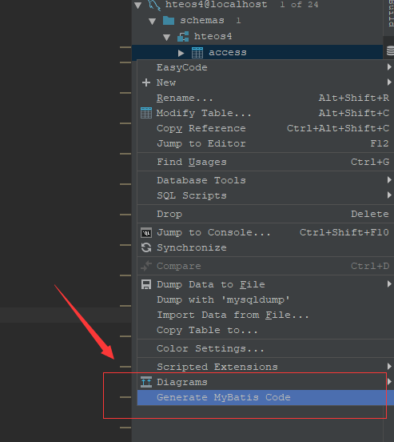
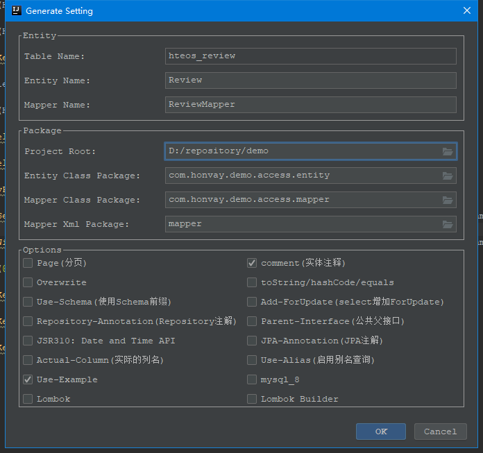
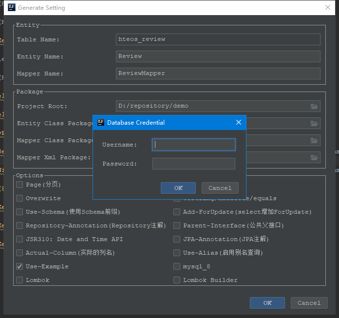
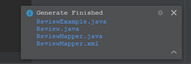

# MyBatis Generator Plus
一款与Idea无缝集成的好用的MyBatis生成器
## 特性：
- 与Idea DataSource插件集成，操作方便
- 提供UI界面对Java代码路径，XML文件路径进行配置
- 提供增强选项，可以选择分页、Lombok等功能
- 支持合并Mapper文件和Xml文件，可以放心修改原来的Mapper文件，无需担心被覆盖

## 操作手册
- 在idea中建立数据库
- 选中要生成的表右键点击弹出菜单，选择 "Generator Mybatis Code"
 

- 在弹出的界面中进行生成配置：
 

- 首次生成需要配置数据库密码：
 

- 配置好之后点击OK生成代码，生成后右下角弹出提示，可以点击文件快速预览
 

## 如何安装
下载根目录下文件：mybatis-generator-plus.zip进行安装